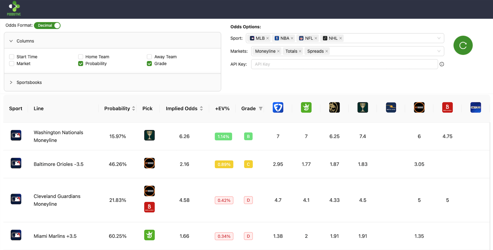

# Poddsitive

<a href="https://poddsitive.com">Poddsitive</a> is a powerful tool designed to help users find **value** in sports betting markets. With its user-friendly interface and robust features, Poddsitive empowers bettors to make informed decisions and maximize their betting strategies.



Try it now at <a href="https://www.poddsitive.com">www.poddsitive.com</a>!

## Features

- **Real-Time Odds**: Access up-to-date odds from multiple sports and markets.
- **Comprehensive Sports Coverage**: Track odds for a wide range of sports including baseball (MLB), football (NFL), basketball (NBA), and more.
- **Odds Types**: Search Moneyline, Over/Under, and Spread Odds to find the best value.
- **Data Analysis Tools**: Utilize built-in analytics to evaluate betting trends and performance.

## Getting Started

To get started with Poddsitive, follow these steps:

1. **Installation**: Clone the repository and install the necessary dependencies.

   ```bash
   git clone https://github.com/yourusername/poddsitive.git
   cd poddsitive
   npm install
   ```

2. **Configuration**: Set up your environment variables. Create a `.env` file in the root directory and add your API keys.

   ```
   ODDS_API_KEY=your_api_key_here
   ```

3. **Run the Application**: Start the application using the following command:
   ```bash
   npm start
   ```

## Contributing

We welcome contributions to Poddsitive! If you have suggestions or improvements, please fork the repository and submit a pull request.
